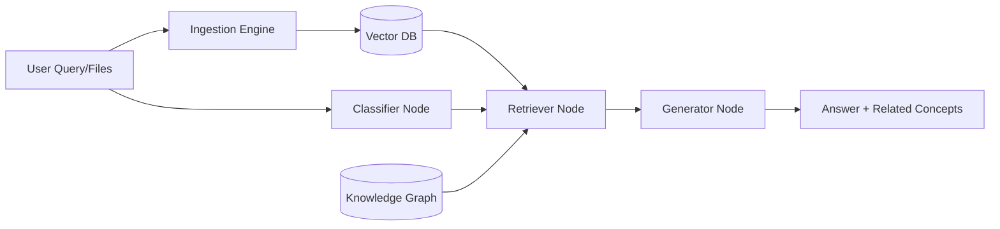

# Agentic Multi-Modal Tutor Architecture

## 1. System Overview
This system implements an **Agentic Multi-Modal RAG** pipeline. It goes beyond standard RAG by using a **LangGraph** orchestrator to classify user intent and a **Knowledge Graph** to expand the context retrieved from traditional vector embeddings.

## 2. Core Components

### A. Ingestion Pipeline (Multi-Modal)
- **Text**: PDF files are parsed using `pdf-parse` and chunked.
- **Images/Audio**: Gemini 1.5 Flash is used as a "feature extractor" to generate semantic descriptions of diagrams and audio clips, which are then indexed in the vector store.
- **Vector Database**: `MemoryVectorStore` using `embedding-001`.

### B. Agentic Workflow (LangGraph)
The state-machine consists of three primary nodes:
1. **Classifier**: Determines if the user wants an *Explanation*, *Summary*, or *Quiz*.
2. **Retriever**: 
   - Performs a similarity search in the Vector DB.
   - Interrogates a **Knowledge Graph** (Concepts -> Relationships) to find adjacent topics.
3. **Generator**: Fuses raw text context, graph relationships, and intent-specific instructions to produce the final answer.

### C. Knowledge Graph (KG)
- **Nodes**: Deep Learning concepts (e.g., Backpropagation).
- **Edges**: "is_a", "explained_by", "related_to".
- **Usage**: When a user asks about "CNNs", the KG automatically suggests "Pooling" and "Feature Maps", even if those specific words weren't high-ranking in the vector search.

## 3. Workflow Diagram

